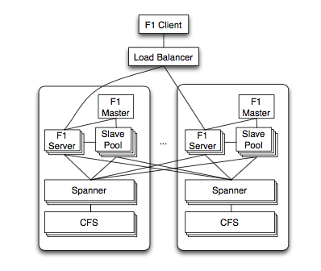



以前读过F1的相关论文，但是很多地方都没有读懂，想再次读的时候发现好像又是重新开始一遍的样子，当年是牺牲了十一的时间看完了所有相关的论文，想来还是记下一些会比较好。文章会主要以翻译[F1](http://static.googleusercontent.com/media/research.google.com/zh-CN//pubs/archive/41344.pdf)为主，也会加上其它相关文章的注解。估计会翻译很久很久吧，哈哈，也会关注[tidb](https://github.com/pingcap/tidb)F1的Go语言实现开发。

## F1: 扩展的分布式SQL数据库

* 摘要

F1是google用来支持AdWords业务而建立的一个分布式关系型数据库系统。F1一种混合型的数据库，将像bigtable那种NoSQL系统的可用性、可扩展性和传统的SQL数据库的一致性、易用性相结合。F1建立在Spanner之上，Spanner提供了跨数据中心的同步副本和强一致性。同步副本会导致更高的提交延时，我们可以通过结构化数据类型的分层Schema模型和灵活的应用层设计来减少延时。F1还包括了一个完整的分布式SQL查询引擎和自动化检测和发布。

* 介绍

F1是Google为了AdWords系统而建立的一种新的存储系统，它是一种容错的，完全分布式的OLTP和OLAP数据库。F1用来替代那些不能够满足可扩展性和可靠性需求的分片MySQL实现。
F1设计的主要目标是：
  * 可扩展性：系统必须可以通过增加资源简单透明地做可扩展。基于MySQL的分片数据库不容易扩展，甚至比较难重新重新负载均衡。我们的用户需要复杂的查询和join，导致对数据的分片不能过细，数据的重新分片也变得很有挑战性。

  * 可用性：系统不应该因为任何原因而宕机，数据中心中断、定期维护、schema变化等。Google核心业务系统存储的数据，任何的宕机都会造成可观的收入影响。

  * 一致性：系统必须提供ACID事务机制，而且应用必须总是呈现一致和正确的数据。在设计应用中来处理并发带来的异常是易错的、耗时的，而且没有足够回报的。

  * 易用性：系统必须提供完善的SQL查询支持和其它SQL数据库提供的功能。像索引和adhoc查询并不是必须得，但对于我们的业务是必须的。

* 基本架构

  * Spanner
* 数据模型
  * 分级Schema
  * Protocol Buffer
  * 索引
* Sechema变化
  * 灵活的锁粒度 
* 事务
* 改变历史
* 客户端设计
  * 简化的ORM
  * NoSQL接口
  * SQL接口
* 查询处理过程
  * 集中和分布式查询
  * 分布式查询样例
  * 远程数据
  * 分布式执行概要
  * 分级表join
  * 分区的消费者
  * Protocol Buffer查询
* 部署
* 延时和吞吐量
* 相关工作
* 总结
